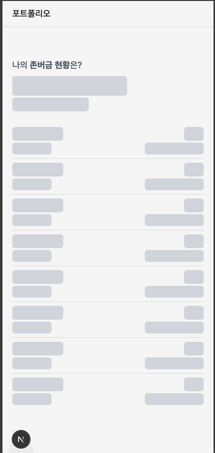
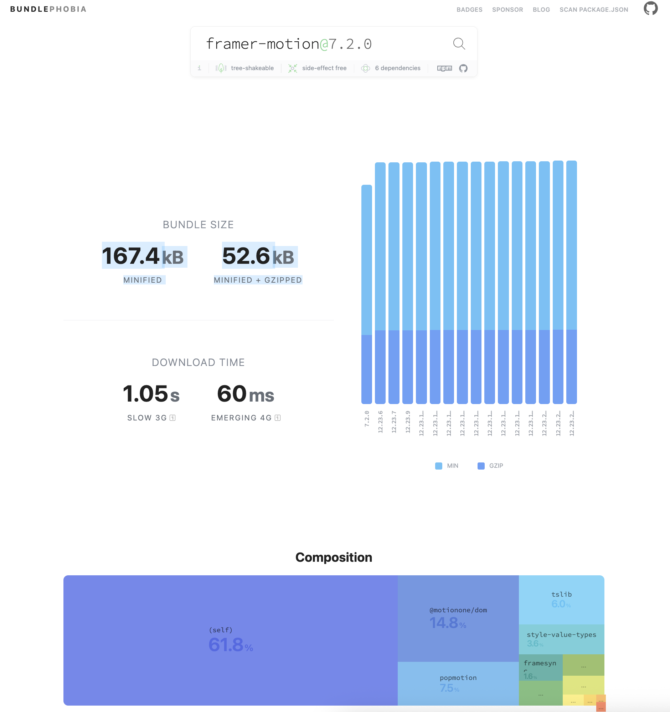

# Jonbeo-Next-TS

증권 MTS 서비스 Next.js + TS 프로젝트입니다. <br />
인프런 [[프레이머를 활용하여 쉽고 간단하게 프로토타입 제작하기]](https://www.inflearn.com/course/%ED%94%84%EB%A0%88%EC%9D%B4%EB%A8%B8-%ED%94%84%EB%A1%9C%ED%86%A0%ED%83%80%EC%9E%85?srsltid=AfmBOookQGlafkwMRnh_wKKB7wmmUmOV5Gvb_Ax00QySR1xlO8eF5FCY) 강의를 기반으로
Framer Motion을 사용한 인터렉션 구현을 목표로 합니다.

## Design 🧑‍🎨

- [Framer](https://framer.com/projects/xFiRc8OAux01S6z56OMj-ephJU)
- [Figma](https://www.figma.com/file/YKbkOiYWBVSNfUZXQY6ENP/jonbeo)

## Getting Started 🚀

```bash
npx msw init public --save
npm run server:portfolio
npm run server:stocks
npm run dev
```

## Goals 🥅

- [ ] Framer Motion을 사용한 인터렉션 구현
- [ ] BFF 구현을 통한 mock API 개발
- [ ] MTS 서비스 차트 구현

## Results 📸



## Folder Structure 📁

```
public/
|   +-- icons/
|   +-- fonts/
src/
+-- apis/  (mock API BFF)
|   +-- client.ts
+-- app/
|   +-- globals.css
|   +-- layout.ts
|   +-- page.ts
+-- components/ (reusable UI components)
|   +-- Icon.tsx
|   +-- Button.tsx
|   +-- ...
+-- hooks/
+-- mocks/
+-- providers/
+-- types/
+-- utils/
.
.
.
```

## Convention

### 1) Naming Conventions 📝

- variable, function: camelCase
- constant variable: SCREAMING_SNAKE_CASE
- class, component name: PascalCase
- folder name, route path: nocase
- html tag properties (ex. className, id etc.): skewer-case

#### 📚 참고

[**Airbnb JavaScript Style Guide**](https://github.com/airbnb/javascript)

```
1. Avoid single letter names. Be descriptive with your naming.
  1-1. Also, Avoid Mental Mapping.

2. Use camelCase when naming objects, functions, and instances.

3. Use PascalCase only when naming constructors or classes. (also file name)

...
```

### 2) Commit Messages 💬

| 태그         | 설명                                                                          |
| ------------ | ----------------------------------------------------------------------------- |
| `feat: `     | 기능 추가                                                                     |
| `fix: `      | 버그를 고친 경우 🛠                                                           |
| `docs: `     | 문서를 수정한 경우 📝                                                         |
| `style: `    | CSS 등 사용자 UI 디자인 변경 🎨                                               |
| `refactor: ` | 프로덕션 코드 리팩토링 🧑‍🔧                                                     |
| `test: `     | 테스트 코드 추가 또는 수정 🧪                                                 |
| `chore: `    | 빌드 태스트 업데이트, 패키지 매니저를 설정하는 경우 (프로덕션 코드 변경 X) ⚙️ |
| `rename: `   | 파일 혹은 폴더명을 수정하거나 옮기는 작업만인 경우 ✍️                         |
| `remove: `   | 파일을 삭제하는 작업만 수행한 경우 🗑️                                         |

## Styling & Animation Library 🎨

### 1. TailwindCSS

#### ASIS

- SCSS 사용 시 커스텀 디자인 토큰, 레이아웃을 위한 클래스명 (`.flex`) 등 사용했으나, 초기 세팅 시간이 오래 걸린다는 단점이 있다.
- 또한 협업 시 커스텀 클래스명을 지정하고 함께 사용하고자 할 때
  모두가 합의한 내용을 등록해야 하기 때문에 시간은 배로 걸릴 수 있다.

#### TOBE

- 최초 세팅 시간 필요하지 않고,
  [공식 문서](https://tailwindcss.com/docs/flex) 확인하여 활용법을 알 수 있다.

### 2. Framer Motion

- 복잡한 애니메이션을 빠르고 쉽게 구현할 수 있기 때문에 채택하였다.
- 가장 큰 이유로는, **전환 방식**(transition)에 있어 이점이 있다고 생각했기 때문이다.
  - AnimatePresence exit 속성 지정함으로써 더욱 쉽게 디자인 컴포넌트 fade out 및 모션을 적용할 수 있었다.

#### 2-1. 왜 Framer Motion을 썼을까?

- Framer Motion은 번들사이즈가 큰 편이다 [[BUNDLEP HOBIA/framer-motion@7.2.0]](https://bundlephobia.com/package/framer-motion@7.2.0)
  

- (공식 문서) [**번들사이즈가 크다는 오해**](https://motion.dev/docs/react-reduce-bundle-size)가 있어요

- 정말 "오해"(misleading)일까?<br />
  페이지 2개에 대해 Chrome Network 탭을 통해 `page.js` Size를 확인해봤을 때 각각 **478kB**, **590kB**
  
  

- `page.js` Size가 미치는 영향은? GPT에게 물어보자

  ```bash
  Q.
  Next.js 프로젝트 개발 중 Framer Motion 라이브러리를 사용해 애니메이션을 구현하는 중이야.
  Chrome Network 탭을 통해 확인해보니 page.js size가 478kB, 590kB가 나왔어.
  각각 아주 단순한 목록 조회 페이지, 상세 페이지를 구현한 건데 저 size는 큰 걸까? 저 size가 미칠 영향은 무엇이 있을까?

  A.
  요약: “단순한 목록/상세 페이지”라면 page.js가 478kB·590kB(전송 용량 기준이라면 더더욱) 은 큰 편입니다.
  (중략)
  저 용량이 미칠 영향
  1. 다운로드 지연: 500kB(gzip 기준 가정)라도 4G/혼잡 구간에서는 수백 ms~수초 추가.
  2. 파싱/컴파일/실행 시간 증가: 대략 모바일 중급기에서 100kB당 수십 ms가 누적(추측·일반치).
  3. 하이드레이션(클라이언트 JS) 비용: App Router라도 Client Component 비중이 크면 메인 스레드가 바쁩니다.
  4. 메모리/배터리: JS 풋프린트가 커질수록 탭 체감 성능 저하.

  기준 감(일반 가이드, 프로젝트별 편차 존재)
  • “간단한” 라우트 한 개당 전송 기준 100~150kB 이하를 목표. 300kB↑이면 최적화 여지가 큼. 500kB대는 과한 편.

  왜 커졌을 수 있나 (Framer Motion 포함)
  • Framer Motion 자체 런타임 + features(제스처, 변형, 스프링 등)가 함께 포함.
  • 페이지에 불필요한 클라이언트 컴포넌트/유틸이 묶여서 route chunk로 같이 번들.
  • UI 라이브러리(아이콘 세트 전체 import 등)와 dayjs/moment 같은 범용 라이브러리가 같이 들어옴.
  • 애니메이션이 사소해도 CSS로 가능한 걸 JS로 처리하면 런타임/번들 모두 손해.
  ```

#### 2-2. Framer Motion 최적화

참고: [[Reduce bundle size]](https://motion.dev/docs/react-reduce-bundle-size)

`page.js` size가 42%(478kB → **203kB**), 53%(590kB → **314kB**)로 축소되었다.


#### (번외) Framer Motion 주요 성능 지표 (Core Web Vitals)에도 영향을 줄까?

번들 사이즈를 줄여보는 번들 최적화를 진행하면서,
"당연히 크기가 줄어드니까 속도에도 도움이 되겠지?" 생각했다.

GPT의 답변에서도 주요 성능 지표에 영향이 있을 것을 추측할 수 있다.

```
단순한 목록/상세 페이지”라면 page.js가 478kB·590kB(전송 용량 기준이라면 더더욱) 은 큰 편입니다.
특히 모바일에서 다운로드 시간 + JS 파싱/컴파일 + 하이드레이션 비용이 늘어나
FCP/LCP/TTI/INP 같은 지표가 악화될 수 있습니다.
```

Lighthouse 검사를 통해서 직접 결과를 비교해보자.

1. 메인 페이지

- LCP: 2.3s 단축 (27.4s → 25.1s)
- TBT: 10ms 단축 (3,010ms → 3,000ms)

| 최적화 전                                                                                            | 최적화 후                                                                                            |
| ---------------------------------------------------------------------------------------------------- | ---------------------------------------------------------------------------------------------------- |
|  |  |

2. 상세 페이지

- LCP: 1.6s 단축 (28.5s → 26.9s)
- TBT: 10ms 단축 (3,450ms → 2,950ms)

| 최적화 전                                                                                                              | 최적화 후                                                                                                      |
| ---------------------------------------------------------------------------------------------------------------------- | -------------------------------------------------------------------------------------------------------------- |
|  |  |

> 만약 다른 리소스 병목이 없고, LCP가 원래 2~3초 수준에서 측정된다고 가정하면:

1. LCP 개선폭:
   - 메인: -2.3s, 상세: -1.6s <br />→ 원래 3초였던 페이지가 0.7~1.4초 수준으로 떨어진 셈
   - 이는 Core Web Vitals 기준에서 나쁨(>4s) → 양호(<2.5s) 구간을 넘기는 정도로, 실사용자 체감에 매우 유의미합니다.

2. TBT 개선폭:
   - 상세 페이지에서 -240ms (3190ms → 2950ms)  
   - Core Web Vitals 권장치는 TBT < 200ms인데, 지금은 수천 ms라 체감 차이가 작습니다.
   - 하지만 병목이 제거된 상황(예: 기본이 400ms였던 페이지라면 → 160ms 수준 감소)이라면 메인스레드 응답성이 크게 좋아져<br/ >사용자가 터치/스크롤 시 바로 반응하는 경험을 할 수 있습니다.
