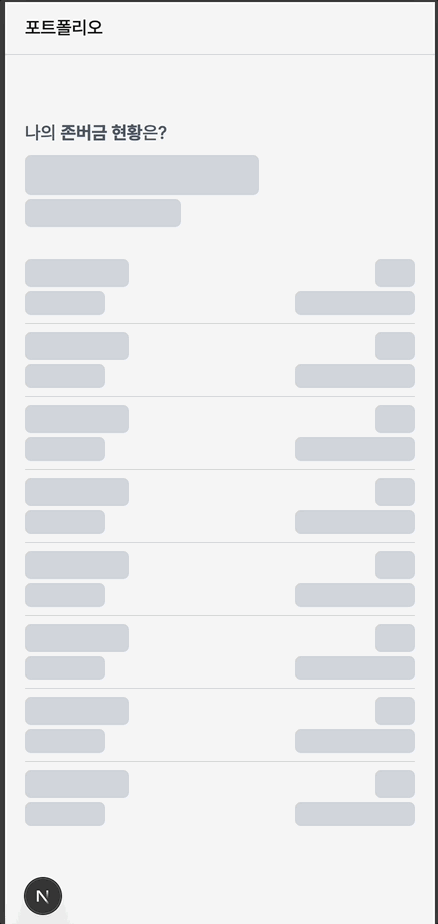

# Jonbeo-Next-TS

증권 MTS 서비스 Next.js + TypeScript 프로젝트입니다. 인프런 [프레이머를 활용하여 쉽고 간단하게 프로토타입 제작하기](https://www.inflearn.com/course/%ED%94%84%EB%A0%88%EC%9D%B4%EB%A8%B8-%ED%99%9C%EC%9A%A9) 강의를 기반으로 Framer Motion 인터랙션을 구현합니다.

## Design 🧑‍🎨

- [Framer](https://framer.com/projects/xFiRc8OAux01S6z56OMj-ephJU)
- [Figma](https://www.figma.com/file/YKbkOiYWBVSNfUZXQY6ENP/jonbeo)

## Getting Started 🚀

```bash
npm install
npm run dev
```

개발 서버는 Next.js Route Handler가 제공하는 mock API를 함께 실행합니다.

- `GET /api/portfolio`
- `GET /api/stocks/:code`

## Goals 🥅

- [ ] Framer Motion 기반 인터랙션 구현
- [x] Next.js Route Handler 기반 mock API 구현
- [ ] MTS 서비스 차트 구현

## Results 📸



## Documentation

- [Framer Motion and performance](./docs/framer-motion-performance.md)
- [Performance refactoring report](./docs/performance-refactoring.md)
- [Performance baseline design](./docs/superpowers/specs/2026-07-24-performance-baseline-design.md)

## Folder Structure 📁

```text
src/
├── apis/        # server data access
├── app/
│   └── api/     # Route Handlers
├── components/
├── data/        # shared mock data access
├── hooks/
├── mocks/
├── providers/
├── types/
└── utils/
```

## Convention

### Naming

- variables and functions: camelCase
- constants: SCREAMING_SNAKE_CASE
- classes and components: PascalCase
- folder names and routes: nocase

### Commit messages

| Tag | Description |
| --- | --- |
| `feat:` | 기능 추가 |
| `fix:` | 버그 수정 |
| `docs:` | 문서 수정 |
| `style:` | UI·스타일 수정 |
| `refactor:` | 프로덕션 코드 리팩터링 |
| `test:` | 테스트 추가·수정 |
| `chore:` | 빌드·도구 설정 변경 |

## Styling and Animation

- [Tailwind CSS](https://tailwindcss.com/)로 스타일을 구성합니다.
- [Motion for React](https://motion.dev/docs/react)로 전환·입력 피드백·모달 애니메이션을 구현합니다.
- 채택 이유, `LazyMotion` 기반 번들 최적화, Core Web Vitals와의 관계는 [Framer Motion and performance](./docs/framer-motion-performance.md)에서 다룹니다.
